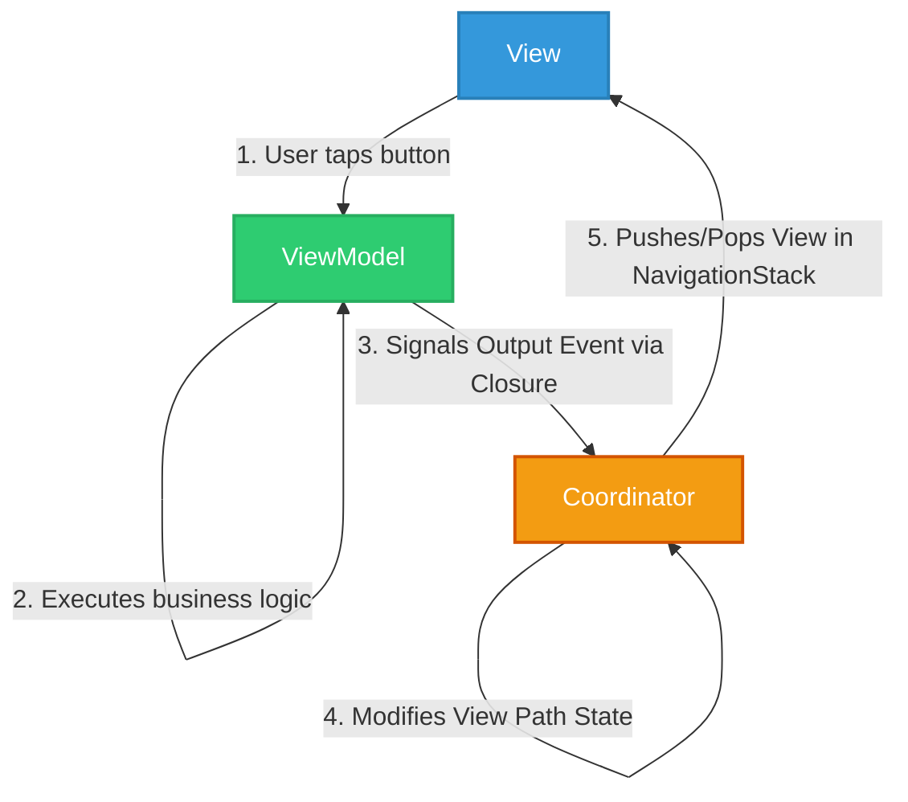
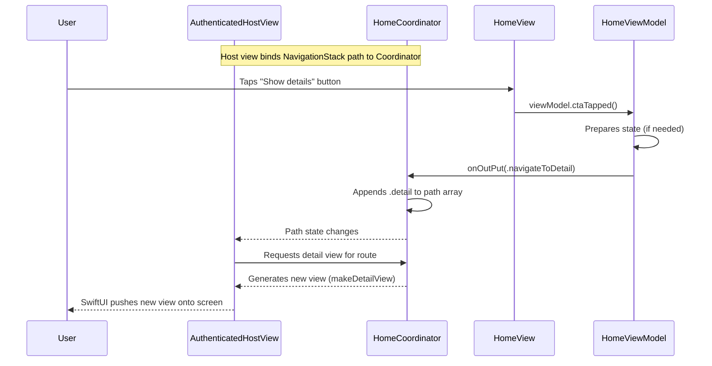

# UI-swift (swiui)

A modern iOS application built with SwiftUI demonstrating the **MVVM-C (Model-View-ViewModel-Coordinator)** architecture using Swift's native Observation framework (`@Observable`). This pattern ensures a strict separation of concerns, decoupling screen navigation from UI creation and presentation logic.

## Architecture Overview

This project is structured around two main architectural pillars: Top-level App Flow management and the MVVM-C pattern for navigating within those flows.

### 1. App Flow Management

The highest level of navigation (e.g., switching from a Splash Screen to Authentication or the Main App) is controlled by the `AppModel`.
- **`AppModel`**: An `@Observable` singleton-like class that maintains the current `flow` (`launching`, `login`, `signup`, `authenticated`).
- **`RootView`**: A top-level view that observes `AppModel` and conditionally renders the appropriate host view based on the current flow state.

### 2. View, ViewModel, and Coordinator (MVVM-C)

Within a specific app flow (like the `authenticated` state), the application uses the MVVM-C pattern.

#### View
Responsible purely for defining the user interface and layout.
- Contains **no navigation or routing logic**.
- Observes the ViewModel to render state.
- Forwards user intentions (like button taps) to the ViewModel.
- *Example:* `HomeView.swift`

#### ViewModel
Contains presentation logic and state management for a specific View.
- Annotated with `@Observable`.
- Processes actions forwarded by the View.
- Defines an output enum (e.g., `HomeVmOutput`) and an output closure (`onOutPut`). It uses this closure to signal to its owner (the Coordinator) that a high-level action or navigation is needed.
- *Example:* `HomeViewModel.swift`

#### Coordinator
The central hub for managing navigation flows (`NavigationStack`) and dependency injection.
- Annotated with `@Observable` and manages the navigation `path` (e.g., an array of `HomeRoutes`).
- Instantiates ViewModels and listens to their `onOutPut` closures.
- Instantiates Views, injecting the corresponding initialized ViewModels.
- Mutates the navigation path in response to ViewModel events, causing the SwiftUI `NavigationStack` to push or pop screens.
- *Example:* `HomeCoordinator.swift`

---

## Architecture Flow Diagrams

### High-level Pattern Interaction

### Deep Dive: Home Screen Routing Example

This is exactly how navigation from the Home screen to the Detail screen is established in this codebase:

